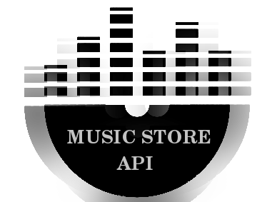

 
 
 

[](https://app.codacy.com/manual/gbzarelli/music-store-api?utm_source=github.com&utm_medium=referral&utm_content=gbzarelli/music-store-api&utm_campaign=Badge_Grade_Dashboard)
[](https://coveralls.io/github/gbzarelli/music-store-api?branch=master)

# Music Store API [](https://circleci.com/gh/gbzarelli/music-store-api)

<p align="center">
    
</p>

The `Music Store API` is an API for inquiries and disco sales,
your database will be powered by the `Spotify` API at system startup,
each disc has a random value between 10 and 100 and is associated with
one of the four pre-defined categories in the system (POP, MPB, CLASSIC and ROCK),
on the sale of the disk a cashback will be created according to the day of the week and the genre
of each disc, these values are also pre-defined according to the system specifications. 

## Specifications
 
 The app should provide a `REST API` containing the following operations::
 
- Consult the disc catalog in paginated way, filtering by the genre and shorting in an increasing 
order by the name of the disc;
- Consult the disc by its identifier;
- Consult all sales made in paginated way, filtering by the range of dates (initial and final) of 
the sale and ordering in decreasing order by the date of the sale;
- Consult a sale by its identifier;
- Register a new disc sale  with the total cashback value considering the table;
 
 - The app will be powered by the `Spotify` database: [`web-api`](https://developer.spotify.com/documentation/web-api/quick-start/)
 - Each sale may have one or more discs selected, the cashback must be calculated and stored 
 individually for each disc as well as the total cashback of the sale;
 
 - When registering a sale, the `API` must send a message to a messaging service passing the
 unique number of the sale
 
## Technologies

 - [`Java/OpenJDK 13`](https://openjdk.java.net/projects/jdk/13/) - Java Development Kit 13
 - [`Spring boot`](https://spring.io) - Framework base for the API
 - [`Flyway`](https://flywaydb.org) - Version control and migration for database
 - [`MySQL`](https://www.mysql.com) - Database
 - [`H2`](https://www.h2database.com) - Database for tests
 - [`Swagger`](https://swagger.io) - Dynamics API documentation
 - [`JPA/Hibernate`](https://hibernate.org/orm/) - Framework for data persistence / ORM
 - [`Docker`](https://www.docker.com) - Run and manage applications inside containers called containers
 - [`RabbitMQ`](https://www.rabbitmq.com) - RabbitMQ messaging service
 - [`jUnit5 e Mockito`](https://junit.org/junit5/) - Tests execution

## Executing with Docker in develop environment

The following steps have been documented to performed on a Linux platform,
but the commands with the Windows system can be similar, but, the operation isn't
fully guaranteed. Make sure you have installed in your environment the `Java` 
(with the $JAVA_HOME in your classpath properly configured) and the `Maven`.

- Clone the project

```shell
$ git clone https://github.com/gbzarelli/music-store-api.git
```

- Access the project folder to start compiling and running the app

```shell
$ cd ./music-store-api
```

- The following instruction will be executed via [`Maven`](https://maven.apache.org)
the `clean` of the project, right after the `package`, which will perform the 
unit tests to guarantee the integrity of the project and to generate our `.jar`,
lastly build [`Dockerfile`](./Dockerfile) will be generated an image
in the local repository called `helpdev/music-store-api`. To build the plugin 
[`dockerfile-maven-plugin`](https://github.com/spotify/docker-maven-plugin) 
 has been configured in the [`pom.xml`](./pom.xml);

```shell
$ mvn clean package dockerfile:build
```

- Configure the following ENVs to `Spotify` access:

| ENV | Description |
| -- | -- |
| SPOTFY_ID | The Spotify credentials ID |
| SPOTFY_SECRET | The Spotify credential secret key |

- After the image will be generated through the `dockerfile:build` we will
mount the containers by [`docker-compose`](./docker-compose.yml).
The prepared compose will go up to the `API`;

```shell
$ docker-compose up
```

## Endpoints

#### Home page
 
 - Home page 
 
   GET http://{address}:8080
 
#### Genres

 - Genre List 
  
        GET http://{address}:8080/genre

#### Discs

- Search disc by ID
 
        GET http://{address}:8080/disc/{id}
  
- Search discs (with pagination)
 
        GET http://{address}:8080/disc{?page=1&limit=50}
 
- Search disc by a genre (with pagination)
 
        GET http://{address}:8080/disc/genre/{genre}{?page=1&limit=50}
 
- Note: [`Pagination parameters`](https://docs.spring.io/spring-data/rest/docs/2.0.0.M1/reference/html/paging-chapter.html)

#### Sales

- New Sale
 
        POST http://{address}::8080/sale

   BODY: 
   ```json
   {
     "discsIds":[1,2,3]
   }
   ```
    
- Search sale by purchase number
  
        GET http://{address}:8080/sale/{orderNumber}
   
- Search sales by date
  
        GET http://{address}:8080/sale/start_date/{startDate}/end_date/{endDate}{?page=1&limit=50}
   
Note: Accepted data format: 'yyyy-MM-dd' ex: `2019-05-23`
 
## The Dynamic documentation with Swagger

The `Swagger` UI provide a display structure who is able to interpret
project endpoints and generate an interactive documentation site;

  - http://{address}:8080/swagger-ui.html
